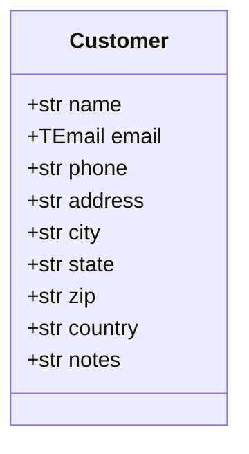

## Examples for SDD
```
myproject/
│
├── AGENTS.md                    ← Global agent rules (never break migrations, use type hints, etc.)
├── ARCHITECTURE.md              ← Django patterns: CBV vs FBV, service layer, signals policy
├── CONVENTIONS.md               ← Naming: models PascalCase, URLs kebab-case, services *_service.py
├── DECISIONS.md                 ← ADRs: why DRF over Ninja, why Celery, etc.
│
├── specs/                       ← Global machine-readable specs
│   ├── openapi.yaml             ← Full API contract (can be auto-generated from DRF)
│   ├── domain-model.yaml        ← All entities & relationships across apps
│   └── constraints.yaml         ← Rules: no raw SQL, no logic in views, max query depth
│
├── config/                      ← Django settings package
│   └── AGENTS.md                ← "Don't touch production settings, use env vars only"
│
├── myproject/
│   ├── users/                   ← Django app
│   │   ├── AGENTS.md            ← App-scoped agent rules
│   │   ├── spec.md              ← Feature description, business rules
│   │   ├── spec.yaml            ← Model fields, validations, edge cases
│   │   ├── openapi.yaml         ← Endpoints for this app only
│   │   └── test-cases.yaml      ← Given/when/then for unit & integration tests
│   │
│   ├── orders/
│   │   ├── AGENTS.md
│   │   ├── spec.md
│   │   ├── spec.yaml
│   │   ├── openapi.yaml
│   │   └── test-cases.yaml
│   │
│   └── payments/
│       ├── AGENTS.md
│       ├── spec.md
│       ├── spec.yaml
│       ├── openapi.yaml
│       └── test-cases.yaml
│
└── frontend/                    ← If using Django templates or a JS framework
    ├── AGENTS.md                ← "Use Tailwind only, no inline styles, HTMX patterns"
    └── component-spec.yaml      ← UI components, props, states
```

## Links / References
Algum tem algumas referências de ferramentas, técnicas e conceitos que podem ser úteis para o desenvolvimento do projeto:

### Sobre Agentes de IA
* [Understanding Spec-Driven-Development: Kiro, spec-kit, and Tessl](https://martinfowler.com/articles/exploring-gen-ai/sdd-3-tools.html)
* [Exploring Generative AI](https://martinfowler.com/articles/exploring-gen-ai.html)
* [A Practical Guide to Spec-Driven Development](https://docs.zencoder.ai/user-guides/tutorials/spec-driven-development-guide)
* [Discussão no Claude sobre SDD](https://claude.ai/share/6b0d7a7a-9236-43b8-9847-d14a53f9910f)
* [How to Use a Spec-Driven Approach for Coding with AI](https://blog.jetbrains.com/junie/2025/10/how-to-use-a-spec-driven-approach-for-coding-with-ai/)

